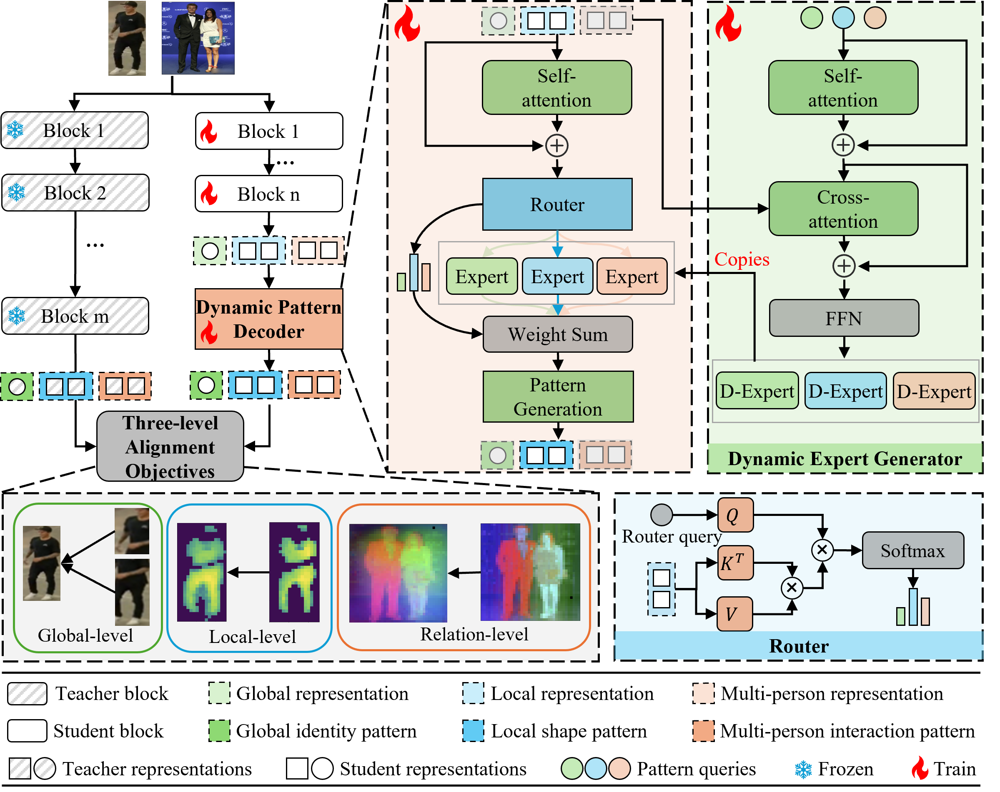

# Dynamic Pattern Alignment Learning for Pretraining Lightweight Human-Centric Vision Models
## 📝 Introduction
We propose Dynamic Pattern Alignment Learning (DPAL), a novel distillation-based pretraining framework that efficiently trains lightweight HVMs to acquire strong generalization from large HVMs. 
Specifically, three typical patterns that are essential for human-centric perception are considered for training generalizable lightweight HVMs, including global identity pattern, local shape pattern and multi-person interaction pattern. 
Driven by this observation, we firstly design a dynamic pattern decoder, acting as a dynamic MoE model that can adaptively extract typical visual patterns conditioning on both input image and pattern queries.
And then, we present three levels of alignment objectives, which aims to minimize generalization gap between lightweight HVMs and large HVMs at global image level, local pixel level, and instance relation level. 
With these two deliberate designs, the DPAL effectively guides lightweight model to learn all typical human visual patterns, which can generalize to various human-centric vision tasks. 
Extensive experiments conducted on 12 challenging datasets demonstrate the effectiveness of the DPAL. Remarkably, when employing PATH-B as the teacher, DPAL-ViT/Ti (5M parameters) achieves surprising generalizability similar to existing large HVMs such as PATH-B (84M) and Sapiens-L (140M), and outperforms previous distillation-based pretraining methods including Proteus-ViT/Ti (5M) and TinyMiM-ViT/Ti (5M) by a large margin. More importantly, the DPAL is performed on a limited dataset (i.e., around 1M unlabeled images) that is unseen for large HVMs, which bypasses the need for those inaccessible or constrained pretraining datasets, offering an affordable approach to generalizable HVMs. 

<div style="text-align: center;">
  
</div>

## 🛠️ Installation
```sh
conda create -n pretrain python=3.10.4
conda activate pretrain

pip install -r requirements.txt
```

## 📖 Dataset and Pretraining Models Preparation
### Dataset
Download LUP4M dataset from [LUPerson](https://github.com/DengpanFu/LUPerson) and randomly sample 1M images to construct LUP1M. Dataset should put in `data` folder.
### Pretraining Models
Download [PATH](https://github.com/OpenGVLab/HumanBench/tree/main/PATH), [SOLIDER](https://github.com/tinyvision/SOLIDER) to `./pretrained_models`.

## 🚀 Train
### Distill PATH-B to ViT-Ti.
```sh
bash scripts/train_kd_path_moe_vit_tiny.sh
```
### Distill PATH-B to ViT-S.
```sh
bash scripts/train_kd_path_moe_vit_small.sh
```
### Distill PATH-B to Swin-Ti.
```sh
bash scripts/train_kd_path_moe_swin_tiny.sh
```
### Distill PATH-B to Swin-S.
```sh
bash scripts/train_kd_path_moe_swin_small.sh
```
### Distill PATH-L to ViT-Ti.
```sh
bash scripts/train_kd_path_large_moe_vit_tiny.sh
```
### Distill PATH-L to ViT-B.
```sh
bash scripts/train_kd_path_large_moe_vit_base.sh
```
### Distill SOLIDER-B to Swin-Ti.
```sh
bash scripts/train_kd_solider_moe_swin_tiny.sh
```
### Distill SOLIDER-B to Swin-S.
```sh
bash scripts/train_kd_solider_moe_swin_small.sh
```